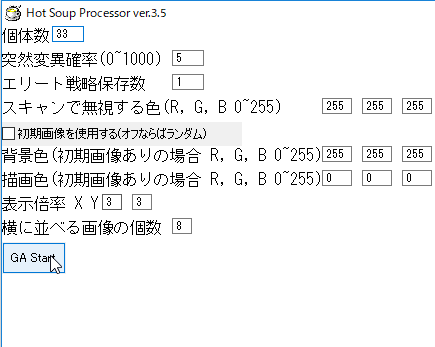
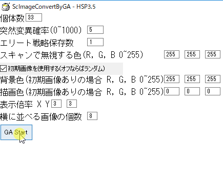

# このソフトについて
遺伝的アルゴリズムを使って、教師データと同じ画像を探索します。  
元号が「平成」から「令和」にかわるこの時期に、それをモチーフにした作品を見ていて、自分も作りたくなって作りました。  
もちろん、画像を変えることで、さまざまな画像を探索・変換させることができます。  

# 使い方
フォルダをまるごとダウンロードして、ScImageConvertByGA.exe を実行してください。  
すぐに「GA Start」ボタンをクリックするとランダム値から「令和」のテキストが描画された画像を探索します。  
起動時の設定画面のパラメータについては以下に記述します。  
レジストリや環境変数は一切変更しないので、アンインストールはこのフォルダごと削除するだけです。

## 扱う画像
imageGoal.bmp は教師データとして読み込まれます。設定画面で「初期画像を使用する」をチェックしないでください。この場合、遺伝子データの描画は imageGoal.bmp の各座標の色が割り当てられます。背景は描画しません。  

imageStart.bmp は0世代のすべての個体の初期値として設定されます。設定画面で「初期画像を使用する」をチェックしてください。この場合、設定画面の背景色と描画色により遺伝子データが描画されます。

imageGoal.bmp と imageStart.bmp は同じサイズにします。異なる場合の動作は不明です。

# 設定画面
起動直後の画面です。  

* 個体数  
各世代の個体数です。
* 突然変異確率  
１ドット単位で突然変異する確率です。今回のデータならば1が0へ、0が1へ変わります。  
0から1000の値を設定します。5ならば0.5%を、1000ならば100%を表します。  
100%の場合は、ランダム探索と似てくると思います。
* エリート戦略保存数  
現世代で最も適合度の高い(正解に近い)個体を次世代へコピーして残す個数です。  
これにより、前の世代よりも適合度の最大が低くなることを防止できます。
* スキャンで無視する色  
画像をドット単位で読み取り、遺伝子のデータとして 1 または 0 に設定するときに使用します。  
この色と同じ場合は 0 (描画しない) を、違う場合は 1 (描画する) を設定します。
* 初期画像を使用する(オフならばランダム)
0世代目の個体の遺伝子データの設定方法を選びます。  
チェックオフの場合は、それぞれの個体の遺伝子座にランダムに 1, 0 が割り当てられます。  
チェックオンの場合は、imageStart.bmp を読み込み、ドットの色に応じて 1, 0 が割り当てられます。
* 背景色,描画色
遺伝子データを画像として描画する際に用います。  
「初期画像を使用する」をチェックオンにした場合に利用されます。  
チェックオフの場合は、imageGoal.bmpの座標に応じた色が描画色として使用され、遺伝子座が 0 の場合は描画されません。
* 表示倍率
0番目の個体の遺伝子データは拡大して表示できます。その表示倍率です。  
エリート戦略で保存された個体は先頭にコピーされるので、エリート戦略で 1 以上を設定した場合、その世代で適合度が最大の個体の遺伝子データが画像として表示されます。

# GA のパラメータ
* 各世代の個体数
* 突然変異の確率(0~1000)
* エリート保存戦略の個体数(0~(個体数-1))
をパラメータとして設定できます。

# 画像データと GA 用の遺伝子データとの相互変換
imageGoal.bmp, imageStart.bmp は各座標の色をスキャンして、遺伝子データに変換されます。  
ドットごとに描画するかしないかを 1 と 0 で表します。  
読み込む際は左上から横優先で一次元配列に格納します。  
例えば、以下の 4 * 3 ピクセルの画像の場合は    

|||||
|---:|---:|---:|---:|
|0|1|2|3|
|4|5|6|7|
|8|9|10|11|

0~11の順番で遺伝子データの配列に格納されます。  
遺伝子データから画像を描画する際も同様にデータを扱います。

# プログラムのファイル構成
* ScImageConvertByGA.hsp  
メインです。GAを操作し結果を画面に表示します。
* ScGaSim.hsp  
遺伝的アルゴリズム(GA)のモジュールです。0か1を要素に持った任意の長さの配列を遺伝子データとして持つ個体を複数持ち、世代を進めながら正しい 0 と 1 の組み合わせを探索します。
* ScVram.hsp
画面にドットを高速で描画する（はず）のモジュールです。

# 動作確認環境
* Windows 10 Home 64bit
* HSP 3.5

# 更新履歴
* 2019/04/15 開発者のgithubで公開。